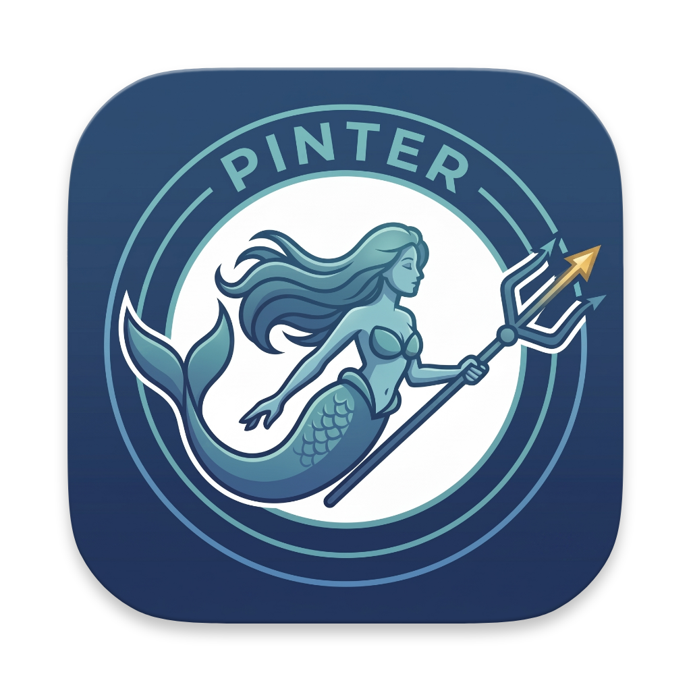

<div align="center">
  
  
  # Mermaid Assistance 🧜‍♀️
  
  **Smart Mermaid Assistance** is a sleek, AI-powered desktop application built with [Wails](https://wails.io) and Vue.js. It brings a stunning, macOS-native Antigravity IDE aesthetic to your diagramming workflow, allowing you to seamlessly generate Mermaid diagrams using AI.
</div>

---

## ✨ Features

- **🎨 Beautiful Antigravity UI**: Experience a premium, glassmorphic dark-mode interface with a seamless, frameless window design that feels 100% native on macOS.
- **🤖 AI Diagram Generation**: Describe what you want in natural language, and let AI generate perfectly formatted Mermaid diagrams for you instantly.
- **🔄 GitHub Synchronization**: Connect your GitHub account to automatically backup, sync, and version control your Mermaid diagrams.
- **🎛️ Custom Models**: Switch seamlessly between different AI models provided by your configured endpoint.
- **🔍 Native Zoom & Pan**: Fluid trackpad integration! Use two-finger scroll to pan around, and pinch-to-zoom to explore large diagrams. 
- **💾 SVG Export**: Instantly download your rendered diagrams as crisp, scalable SVG files.
- **💻 Integrated Code Editor**: Need manual tweaks? Toggle the built-in raw Mermaid code editor and see your changes render in real-time.

---

## 🚀 Getting Started

### Prerequisites
- Go 1.20+
- Node.js & npm
- [Wails CLI](https://wails.io/docs/gettingstarted/installation)

### Running Locally
To run the app in live development mode with hot-reload:
```bash
wails dev
```

### Building for Production
To build a redistributable, production mode package:
```bash
wails build
```

---

## ⚙️ Configuration

Open the **Settings** menu within the app to configure:
- **Base URL**: Your AI API endpoint.
- **API Key**: Authentication for your AI provider.
- **GitHub Token**: Personal access token (PAT) for diagram synchronization.
- **GitHub Repo**: The repository name (e.g., `username/repo`) to store your diagrams.
